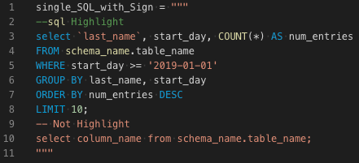
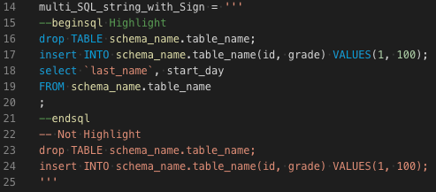
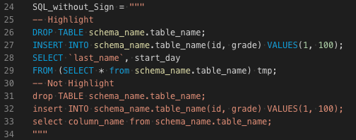
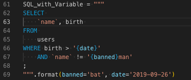

# Highlight String Code

Syntax highlighting support for some specific language code in string.

## Requirements

- Visual Studio Code v1.6.0 and above is recommended, but I'm not sure.

## Features & Usages

- SQL
  1. Insert sign pair `--sql` and `;` to highlight one SQL sequence. 
  
  2. Insert sign pair `--beginsql` or `--begin-sql` and `--endsql` or `--end-sql` to highlight one and more SQL suquences. 
  
  3. Any SQL sequence starts with **UPPERCASE** keyword (such as `SELECT`, `INSERT`, `UPDATE` and etc), and ends with `;` will be highlighted automatically. 
  
- HTML
  - Insert sign pair `<!--html-->` and `<!--!html-->` to highlight one and more HTML suquences. Other comments can be added after `html` and `-->`. 
  
- Other
  - Highlight Variables in *highlighted* string code. 
  

## Installation

- Install from VS Code extensions (`ctrl + shift + x` or `cmd + shift + x` on mac).
- Install from [VSIX](https://github.com/iuyoy/highlight-string-code/releases) manually.

## Release Notes

See [CHANGELOG.md](./CHANGELOG.md)

## References

- Forked from [bashmish/es6-string-css](https://github.com/bashmish/es6-string-css) > [ptweir/python-string-sql](https://github.com/ptweir/python-string-sql)
- Visual Studio Code Extension API
  - [syntax-highlight-guide](https://code.visualstudio.com/api/language-extensions/syntax-highlight-guide)
- TextMate Manual
  - [Language Grammars](https://macromates.com/manual/en/language_grammars)
  - [Scope Selectors](https://macromates.com/manual/en/scope_selectors)