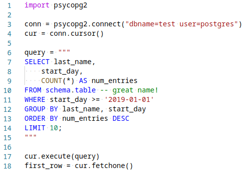

# SQL highlighting in Python multiline strings for VS Code 

Adds syntax highlight support for python multiline SQL strings in VS Code.

## Installation

Install `python-string-sql` from extensions (`ctrl + shift + x` or `cmd + shift + x` on mac).
> Also available on [marketplace.visualstudio.com](https://marketplace.visualstudio.com/items?itemName=ptweir.python-string-sql)

## Example

[](docs/demo.py)

## Usage

In a `""" multi-line """` or `f""" f-string multiline """` string, use a `select`, `with`, or `-- sql-comment`, and the string will then be treated as embedded SQL.

### Snippets
begin typing `sql` and the autocomplete snippet will appear:


### Keybindings

cmd+s (or ctrl+s on mac) - Insert the following snippet:
```
"""
SELECT
;
"""
```

## Requirements

- Visual Studio Code v1.32.0 recommended
- Comments at beginning and end of highlighted section in the string (see Usage section).

## Community
- 2018-09-04 forked from [es6-string-css](https://github.com/bashmish/es6-string-css)

## Release Notes

### [1.1.0] - 2019-06-04
- Added support for f-strings

### [1.0.0] - 2019-03-29
- Added snippet and keybinding

### [0.1.0] - 2019-03-28
- Published on VS Code marketplace

### [0.0.1] - 2019-03-28
- Got it working based on [these instructions](https://code.visualstudio.com/api/language-extensions/syntax-highlight-guide)

### [0.0.0] - 2018-09-04
- Forked from es6-string-html

